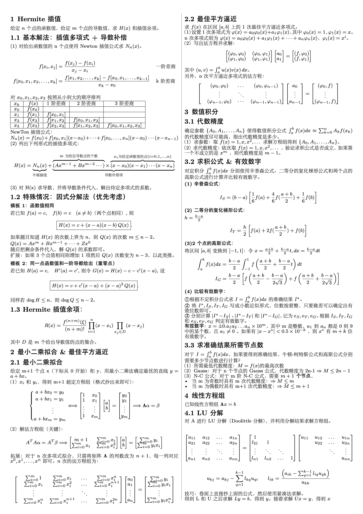
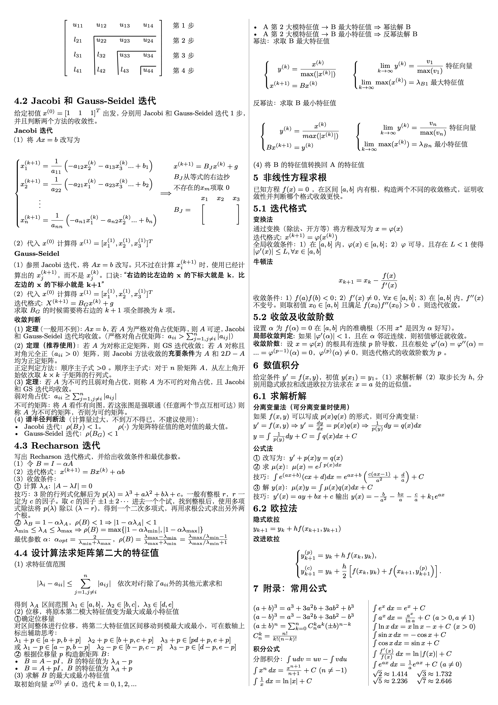

# SCU《现代数学基础》一页纸笔记

本仓库为四川大学2025年秋季学期《现代数学基础》课程的1页笔记。由于老师只允许考试带1页纸，所以使用 LaTeX 排版了一份紧凑的现代数学基础笔记。

笔记严格按照老师期末考试的6道大题整理。

> 2026-01-13：考完了，考试时间非常紧张（几乎不够）。建议：在考试的时候多列公式，不要执着于全部算完，把握好时间。

## 下载

[PDF下载](https://github.com/Kelfvin/scu_modern_math_foundation/releases/latest)

## 预览

以下为笔记内容预览（非最新、最新请查看release）：

